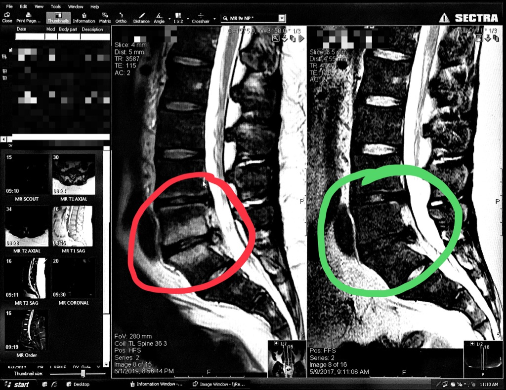

I have not been active on social media or GitHub the past few months.  I have a pretty good reason for that: I have been battling a severe flair up of my spine injury.

I herniated two discs in my spine back in 2008.  Since then I have been in and out of doctors' offices trying to manage it.  There have been ups and downs but for the most part I learned to live with it.  Things took a turn for the worse starting October 2018.  I cannot describe exactly when it started but suddenly I was living a life of constant pain.  Literally, I felt pain at all hours of the day - an absolutely terrible experience.  Next thing I knew, I was cycling amongst nine different doctors trying to get a handle on what was wrong.  I saw this image in June 2019:

The parts of my spine in the green circle are from two years ago.  The discs appear dark because they are damaged and do not carry much water anymore.  See the white substance in the red circle on the bone?  That was the "unknown" my doctors have been working to solve for the past couple months.  For the first two weeks there was a legitimate concern it was life threatening.  Fortunately it was not life threatening but I was back to square one: why am I in so much constant pain?

Unfortunately there is no answer.  I still deal with pain regularly.  I am now admitted into a pain clinic, I continue to see a therapist, and I recently had an epidural injection.  I do my best to stay active and be social but it is not always easy.  I have backed off my donut crusade and started focusing on eating better.  It has contributed to dropping 30 pounds but there is plenty more weight to lose.

Lately, though, life has started feeling normal again.  I have accepted this and am now learning to live with this new condition.  I have resumed my coding and studying sessions.  I restarted my mentorship and recruiting efforts at work.  And now I am back to writing regularly and taking to this new outlet to share updates and insights with you.  I do not know exactly what I will use this blogging platform for, but I hope you will stick around to find out.

Thanks for checking in.
